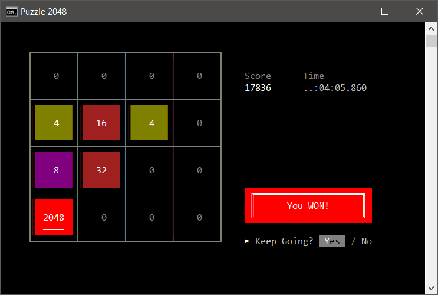
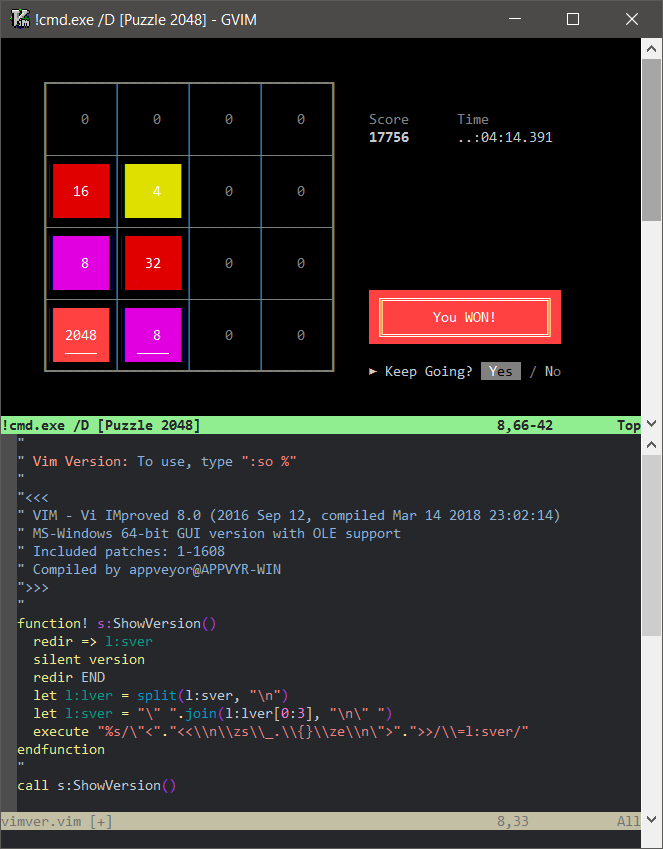

X800W
=====

A 2048 puzzle clone for Windows console.

Play [original 2048 here](https://gabrielecirulli.github.io/2048/)
that is created by Gabriele Cirulli.

Below is a screenshot of 2048 on Windows 10 cmd.exe with Consolas font.

Playing 2048 on Windows Console
-------------------------------

Run 2048.exe from a command prompt, and use the arrow keys.

| Key | Function |
|-----|----------|
| *Arrow keys* | move tiles |
| `t` | Transpose board |
| `r` | Rotate board clockwise |
| `R` | Rotate board anticlockwise |
| `v` | Vertically flip board |
| `h` | Horizontally flip board |
| `i` | Initialize board (unconditionally a new game starts) |
| `z` | Undo (only once, and if pressed immediately) |
| `e` | ? *(pressed more than once)* |
| `w` | ? *(pressed more than once)* |
| `F5` | Redraw board |
| `q` | quit game (unconditionally, no confirmation) |
| `Escape` | quit game (unconditionally, no confirmation) |

### Command line options

The `2048.exe` executable supports following options:

| short option | long option | description |
| ------------ | ----------- | ----------- |
| -c *VALUE* | --color=*VALUE* | color scheme: `0`, `1`, `2` or `3` (default: 0) |
| -g *VALUE* | --grid=*VALUE* | draw with `ascii` or `unicode` characters (default: unicode) |
| -w | --wipe | wipes the display when exiting (default: do not wipe) |
| | --test | with '--color' shows color scheme and exit |
| | --tile-set=*VALUE* | previews grid/tiles, choices `1`, `2` or `3` (default: 1) |
| | --version | displays version and other info |
| | --help | this help info (except help and version) |

### Quirks

Mouse clicks are supported to some extent. With older Windows or
with _`Use legacy console`_ option in Windows 10, mouse wheel
can be used --- can try mouse wheel with shift key too.

> **Caution**: a mouse operation with a modifier key does
> something weird!

> **Note**: *There are some known bugs and idiosyncrasies not fixed
> since they presumably make game more interesting!*

>
> **Hint**: Keep bottom row filled, then game can be fast paced.
> For example `2` will not appear once `256` or higher block obtained,
> and so on...
>

#### Font

Known to run on Windows 10 (Home).
There can be font issues with older versions of Windows.

Try `Consolas` font. With other fonts there can be gaps or missing characters.

#### Other consoles

The 2048 console game is tested with cmd.exe of Windows 10.

Of course, 2048 runs on Console2, ConsoleZ or Cmder, but possibly without mouse
support and there are other limitations, for example color related issues.

*The colors set by `--color=3`  option is based on Cmder.*

#### GUI Vim's `:terminal`

The recent releases of Vim includes a feature for running
a terminal emulator in a Vim window.

With *terminal* feature, it is possible to play the game in a Vim window!
See screenshot below.

Above screenshot uses Consolas font and also with the following setup:

* `set linespace=0  " removes gaps in grid-lines`
* `set shell=cmd.exe\ /D  " Don't load any AutoRun commands`
* `highlight Terminal guibg=black  " corrects background color`

Why just another 2048 clone?
----------------------------

Actually *playing* with some Win32 console API using LLVM/GCC/MSVC
compilers and collecting some pieces of code in one place.

These pieces are variations of old codes used when writing code
for quick testing purposes in odd circumstances with Windows OSes.

Compilation
-----------

### Supported compilers

Known to compile with below compilers. (There can be warnings.)

* MSVC 2015 (Community) or MSVC 2017 (Build Tools)
* MinGW-w64 GNU/GCC 6.3 or 7.3 (g++ from MinGW-w64 posix-seh)
* LLVM 5.0 or 6.0 with one of above compilers (MSVC or MinGW-w64 GCC 7.3)
* MinGW GNU/GCC 6.3 (g++ from `mingw.org`) *with few trade-offs*

Minimal compilation command can be:

* cl -EHsc 2048.cpp
* g++ 2048.cpp
* clang++ 2048.cpp

### Using cc.bat

A single file compilation helper batch file `cc.bat` can also be used.
`cc.bat` sets few macros and automates collecting few trickier or more useful
info on tool chains used.

Create `vce.bat` that calls *VS2015 x64 Native Tools Command Prompt* and place
it in the `PATH` or in the current directory. Or create `g73.bat` that setups
*Mingw-w64 GNU/GCC 7.2* `x86_64-posix-seh` from `SourceForge.net` or
*MinGW Distro* from `nuwen.net` (compiled by *Stephan T. Lavavej*).

Examples to compile with cc.bat in a command prompt:
*(below are valid for current directory where 2048.cpp is found)*

* cc.bat e 2048.cpp
* cc.bat 7 2048.cpp

Or to see more warnings:

* cc.bat e 2048.cpp -Wall
* cc.bat 7 2048.cpp -Weffc++ -pedantic -Wunused

Or in a command prompt, try the below to compile using LLVM with GCC

*   > *:: setup GCC 7.3 MinGW-w64 posix-seh environment* 
    > g72.bat 
    > *:: setup LLVM/clang 6.0 environment* 
    > l60.bat 
    > *:: call cc.bat with already setup environment* 
    > cc.bat @ 2048.cpp 

And also try `2048 --version` to see the details.

> Note: cc.bat uses numeric identifiers for compilers to make it easier to call
> from Vim as *makeprg*; see *_vimrc* in *config repo*.

License
-------

> **TODO**: *check Free Software Foundation, Inc. for possible licenses.*

If stealing fragments of the code, assume zlib license or public
domain and feel free to modify and use.

Acknowledgements
----------------

MSDN web pages and GCC and LLVM manuals deserve credits.
Also, some posts found at `stackoverflow.com` have helped to
isolate/remove compiler compatibility issues or tricky issues
with Win32 API.

